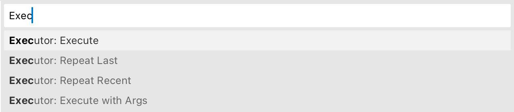
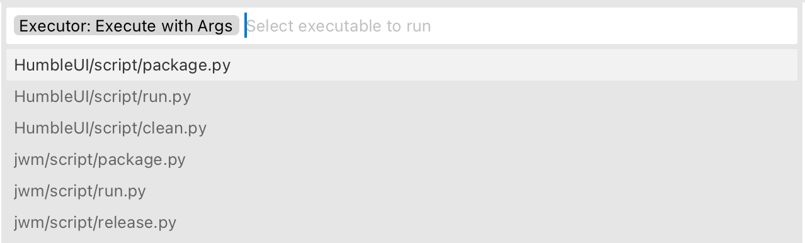

# Run any executable from your working dir in Sublime Text

Simple plugin that walks your current working directories, finds all files marked as executable and let you run them inside Sublime Text.

Gives you five basic commands:

- Executor: Execute
- Executor: Execute with Args
- Executor: Repeat Recent
- Executor: Repeat Last
- Executor: Cancel

Uses `output.exec` panel to stream both stdout and stderr.

Knows about `.gitignore` enough to skip looking into ignored paths.

## Known limitations

- Probably doesn’t work on Windows
- `!` in `.gitignore` is not supported
- Global `.gitignore` is not supported
- Sublime Text excludes are not supported
- On large projects listing might take long time

## Credits

Made by [Niki Tonsky](https://twitter.com/nikitonsky).

## See also

[Writer Color Scheme](https://github.com/tonsky/sublime-scheme-writer): A color scheme optimized for long-form writing.

[Alabaster Color Scheme](https://github.com/tonsky/sublime-scheme-alabaster): Minimal color scheme for coding.

[Sublime Profiles](https://github.com/tonsky/sublime-profiles): Profile switcher.

[Clojure Sublimed](https://github.com/tonsky/clojure-sublimed):  Clojure support for Sublime Text 4.

## License

[MIT License](./LICENSE.txt)
